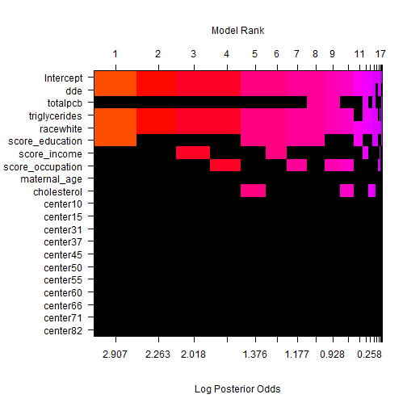
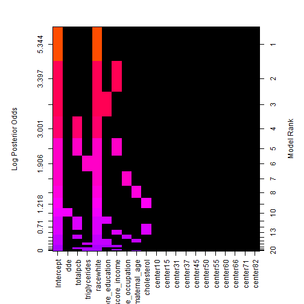

Effect of chemical exposure on preterm risk
========================================================
author: Olivier Binette, Brian Kundinger and Joe Mathews
date: January 21, 2020
autosize: true

The Longnecker dataset
======================================================== 

For more details on authoring R presentations please visit <https://support.rstudio.com/hc/en-us/articles/200486468>.

- Bullet 1
- Bullet 2
- Bullet 3

Slide With Code
========================================================


```r
summary(cars)
```

```
     speed           dist       
 Min.   : 4.0   Min.   :  2.00  
 1st Qu.:12.0   1st Qu.: 26.00  
 Median :15.0   Median : 36.00  
 Mean   :15.4   Mean   : 42.98  
 3rd Qu.:19.0   3rd Qu.: 56.00  
 Max.   :25.0   Max.   :120.00  
```

Slide With Plot
========================================================


EDA
========================================================


Imputation
========================================================

* Approximately 79% of the observations were complete cases. Most incomplete cases came from the "score" variables.

* A standard Bayesian approach to data imputation was taken for each score variable:
    * The observed score variables were regressed onto the other predictors.
    * Missing values were treated as model parameters and were estimated using their respective posterior mean.
* A few potential problems with this approch:
    * Treating each score variable as a linear function of the other predictors is hard to justify.
    * Multicolinearity amongst the predictors (e.g., _cholesterol_ and _triglycerides_).
* Possible improvements:
    * Propogate uncertainty associated with using imputation methods.
    * Apply a non-linear model to estimate missing values. 


Model
========================================================
We first define "preterm" as gestational age less than 37 months, and compare it to "early preterm," defined as  gestational age less than 34 months.

We use logistic regression to regress preterm against all other variables, and find that dde, totalpcb, triglycerides, race, and center 37 are statistically significant

```r
require(dplyr)
require(BAS)
data = readRDS("Longnecker.rds")

data = data %>% 
  select(-albumin) %>% 
  filter(gestational_age < 60)
  mutate
```

```
function (.data, ...) 
{
    UseMethod("mutate")
}
<bytecode: 0x00000000186eb608>
<environment: namespace:dplyr>
```

```r
complete_data = data[complete.cases(data), ]
complete_data <- mutate(complete_data, preterm =  case_when(
  gestational_age<37 ~ 1, 
  gestational_age>=37 ~ 0
), earlypreterm = case_when(
  gestational_age<34 ~ 1, 
  gestational_age>=34 ~ 0
), totalpcb = pcb_028 + pcb_052 + pcb_074 + pcb_105 + pcb_118 + pcb_153 + pcb_170 + pcb_138 + pcb_180 +pcb_194 +pcb_203, 
  race = factor(ifelse(race=="white", "white", "other")),
  center = factor(center),
  smoking_status = factor(ifelse(smoking_status, "smoking", "non-smoking"))
)

#Models for preterm
model.base <- glm(preterm ~ dde + totalpcb + triglycerides + race + score_education + score_income + score_occupation + maternal_age + cholesterol + center-1, data = complete_data, family = "binomial")
summary(model.base)
```

```

Call:
glm(formula = preterm ~ dde + totalpcb + triglycerides + race + 
    score_education + score_income + score_occupation + maternal_age + 
    cholesterol + center - 1, family = "binomial", data = complete_data)

Deviance Residuals: 
    Min       1Q   Median       3Q      Max  
-1.2217  -0.6101  -0.4726  -0.3359   2.8547  

Coefficients:
                   Estimate Std. Error z value Pr(>|z|)    
dde               0.0090618  0.0033045   2.742 0.006102 ** 
totalpcb          0.0990187  0.0399498   2.479 0.013191 *  
triglycerides     0.0030509  0.0008643   3.530 0.000416 ***
raceother        -1.8206628  0.5308579  -3.430 0.000604 ***
racewhite        -2.2388627  0.5012193  -4.467 7.94e-06 ***
score_education  -0.0038783  0.0031171  -1.244 0.213419    
score_income     -0.0022411  0.0027884  -0.804 0.421557    
score_occupation -0.0035428  0.0028314  -1.251 0.210842    
maternal_age     -0.0106376  0.0112156  -0.948 0.342896    
cholesterol      -0.0019239  0.0011345  -1.696 0.089933 .  
center10         -0.8664738  0.4964937  -1.745 0.080952 .  
center15          0.5244669  0.3695339   1.419 0.155822    
center31         -0.9005510  0.5782236  -1.557 0.119365    
center37          0.6237011  0.3018010   2.067 0.038772 *  
center45         -0.0383177  0.3551997  -0.108 0.914094    
center50          0.0521911  0.3735944   0.140 0.888897    
center55         -0.1701998  0.5339237  -0.319 0.749900    
center60          0.2257771  0.3687059   0.612 0.540306    
center66         -0.0065449  0.3150313  -0.021 0.983425    
center71         -0.1638199  0.3650224  -0.449 0.653580    
center82          0.2967967  0.3655015   0.812 0.416777    
---
Signif. codes:  0 '***' 0.001 '**' 0.01 '*' 0.05 '.' 0.1 ' ' 1

(Dispersion parameter for binomial family taken to be 1)

    Null deviance: 2568.8  on 1853  degrees of freedom
Residual deviance: 1448.0  on 1832  degrees of freedom
AIC: 1490

Number of Fisher Scoring iterations: 5
```

```r
#Variations on model for preterm
step.model.base <- step(model.base)
```

```
Start:  AIC=1490.01
preterm ~ dde + totalpcb + triglycerides + race + score_education + 
    score_income + score_occupation + maternal_age + cholesterol + 
    center - 1

                   Df Deviance    AIC
- score_income      1   1448.7 1488.7
- maternal_age      1   1448.9 1488.9
- score_education   1   1449.6 1489.6
- score_occupation  1   1449.6 1489.6
<none>                  1448.0 1490.0
- cholesterol       1   1450.9 1490.9
- center           11   1471.3 1491.3
- totalpcb          1   1453.9 1493.9
- dde               1   1455.3 1495.3
- triglycerides     1   1460.2 1500.2
- race              2   1469.8 1507.8

Step:  AIC=1488.66
preterm ~ dde + totalpcb + triglycerides + race + score_education + 
    score_occupation + maternal_age + cholesterol + center - 
    1

                   Df Deviance    AIC
- maternal_age      1   1449.8 1487.8
- score_education   1   1450.7 1488.7
<none>                  1448.7 1488.7
- score_occupation  1   1450.9 1488.9
- cholesterol       1   1451.6 1489.6
- center           11   1472.4 1490.4
- totalpcb          1   1454.6 1492.6
- dde               1   1455.8 1493.8
- triglycerides     1   1460.8 1498.8
- race              2   1471.9 1507.9

Step:  AIC=1487.75
preterm ~ dde + totalpcb + triglycerides + race + score_education + 
    score_occupation + cholesterol + center - 1

                   Df Deviance    AIC
- score_education   1   1451.3 1487.3
<none>                  1449.8 1487.8
- score_occupation  1   1451.9 1487.9
- cholesterol       1   1452.5 1488.5
- center           11   1474.0 1490.0
- totalpcb          1   1455.0 1491.0
- dde               1   1457.1 1493.1
- triglycerides     1   1461.2 1497.2
- race              2   1493.5 1527.5

Step:  AIC=1487.32
preterm ~ dde + totalpcb + triglycerides + race + score_occupation + 
    cholesterol + center - 1

                   Df Deviance    AIC
<none>                  1451.3 1487.3
- cholesterol       1   1454.3 1488.3
- score_occupation  1   1455.5 1489.5
- totalpcb          1   1456.6 1490.6
- center           11   1477.5 1491.5
- dde               1   1459.1 1493.1
- triglycerides     1   1463.4 1497.4
- race              2   1505.4 1537.4
```

```r
summary(step.model.base)
```

```

Call:
glm(formula = preterm ~ dde + totalpcb + triglycerides + race + 
    score_occupation + cholesterol + center - 1, family = "binomial", 
    data = complete_data)

Deviance Residuals: 
    Min       1Q   Median       3Q      Max  
-1.1765  -0.6089  -0.4717  -0.3431   2.8277  

Coefficients:
                   Estimate Std. Error z value Pr(>|z|)    
dde               0.0093171  0.0032878   2.834 0.004599 ** 
totalpcb          0.0930574  0.0393865   2.363 0.018144 *  
triglycerides     0.0030052  0.0008513   3.530 0.000415 ***
raceother        -2.3688866  0.4076355  -5.811 6.20e-09 ***
racewhite        -2.7517223  0.3858779  -7.131 9.96e-13 ***
score_occupation -0.0052429  0.0025802  -2.032 0.042158 *  
cholesterol      -0.0019177  0.0011263  -1.703 0.088628 .  
center10         -0.9196279  0.4937931  -1.862 0.062550 .  
center15          0.6764446  0.3566560   1.897 0.057877 .  
center31         -0.8695330  0.5772040  -1.506 0.131950    
center37          0.7220068  0.2969920   2.431 0.015055 *  
center45          0.1139849  0.3441222   0.331 0.740468    
center50          0.0392516  0.3725556   0.105 0.916092    
center55         -0.0378215  0.5281416  -0.072 0.942910    
center60          0.3029719  0.3654651   0.829 0.407102    
center66          0.1059767  0.3085510   0.343 0.731248    
center71         -0.0576416  0.3599326  -0.160 0.872766    
center82          0.4347929  0.3567985   1.219 0.222998    
---
Signif. codes:  0 '***' 0.001 '**' 0.01 '*' 0.05 '.' 0.1 ' ' 1

(Dispersion parameter for binomial family taken to be 1)

    Null deviance: 2568.8  on 1853  degrees of freedom
Residual deviance: 1451.3  on 1835  degrees of freedom
AIC: 1487.3

Number of Fisher Scoring iterations: 5
```

Model
========================================================
We compare this result with Bayesian Model Averaging.

```r
bas.model.base <- bas.glm(preterm ~ dde + totalpcb + triglycerides + race + score_education + score_income + score_occupation + maternal_age + cholesterol + center, data = complete_data, family = binomial(link = "logit"), modelprior = uniform(), MCMC.iterations = 10000)
summary(bas.model.base)
```

```
                 P(B != 0 | Y)   model 1      model 2      model 3
Intercept               1.0000    1.0000    1.0000000    1.0000000
dde                     0.9166    1.0000    1.0000000    1.0000000
totalpcb                0.2332    0.0000    0.0000000    0.0000000
triglycerides           0.8870    1.0000    1.0000000    1.0000000
racewhite               0.9925    1.0000    1.0000000    1.0000000
score_education         0.5240    1.0000    0.0000000    0.0000000
score_income            0.2346    0.0000    0.0000000    1.0000000
score_occupation        0.3090    0.0000    0.0000000    0.0000000
maternal_age            0.0706    0.0000    0.0000000    0.0000000
cholesterol             0.1765    0.0000    0.0000000    0.0000000
center10                0.0000    0.0000    0.0000000    0.0000000
center15                0.0000    0.0000    0.0000000    0.0000000
center31                0.0000    0.0000    0.0000000    0.0000000
center37                0.0000    0.0000    0.0000000    0.0000000
center45                0.0000    0.0000    0.0000000    0.0000000
center50                0.0000    0.0000    0.0000000    0.0000000
center55                0.0000    0.0000    0.0000000    0.0000000
center60                0.0000    0.0000    0.0000000    0.0000000
center66                0.0000    0.0000    0.0000000    0.0000000
center71                0.0000    0.0000    0.0000000    0.0000000
center82                0.0000    0.0000    0.0000000    0.0000000
BF                          NA    1.0000    0.4826872    0.2454399
PostProbs                   NA    0.1866    0.0980000    0.0767000
R2                          NA    0.0469    0.0418000    0.0451000
dim                         NA    5.0000    4.0000000    5.0000000
logmarg                     NA -758.3696 -759.0979866 -759.7743033
                      model 4      model 5
Intercept           1.0000000    1.0000000
dde                 1.0000000    1.0000000
totalpcb            0.0000000    0.0000000
triglycerides       1.0000000    1.0000000
racewhite           1.0000000    1.0000000
score_education     0.0000000    1.0000000
score_income        0.0000000    0.0000000
score_occupation    1.0000000    0.0000000
maternal_age        0.0000000    0.0000000
cholesterol         0.0000000    1.0000000
center10            0.0000000    0.0000000
center15            0.0000000    0.0000000
center31            0.0000000    0.0000000
center37            0.0000000    0.0000000
center45            0.0000000    0.0000000
center50            0.0000000    0.0000000
center55            0.0000000    0.0000000
center60            0.0000000    0.0000000
center66            0.0000000    0.0000000
center71            0.0000000    0.0000000
center82            0.0000000    0.0000000
BF                  0.6424803    0.1766661
PostProbs           0.0763000    0.0404000
R2                  0.0463000    0.0486000
dim                 5.0000000    6.0000000
logmarg          -758.8120192 -760.1030936
```

```r
image(bas.model.base, rotate = F)
```



Model
========================================================
When we regress "early preterm" through logistic regression, we find only totalbcp and race significant. We compare this with BAS, where we find that only race shows up substantially often in simulated data sets.

```r
#Models for early preterm
model.base.early <- glm(earlypreterm ~ dde + totalpcb + triglycerides + race + score_education + score_income + score_occupation + maternal_age + cholesterol + center, data = complete_data, family = "binomial")

bas.model.base.early <- bas.glm(earlypreterm ~ dde + totalpcb + triglycerides + race + score_education + score_income + score_occupation + maternal_age + cholesterol + center, data = complete_data, family = binomial(link = "logit"), modelprior = uniform(), MCMC.iterations = 10000)
image(bas.model.base.early)
```



Model
========================================================
In comparing results based on different definitions of preterm birth, we find that it is likely the case the DDE (and to a lesser extent, PCB) are associated with early birth. However, in the more extreme cases, where gestational age is less than 34 years, there are likely other factors not represented in the data that account for this difference. 


Conclusion
========================================================

* Multicolinearity amongst the predictors is a poential issue with the analysis
  * 


